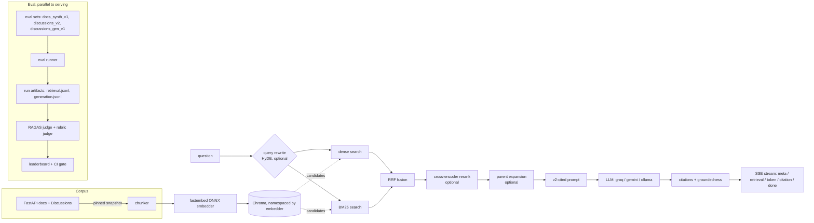

# RAG + Eval Harness

[](https://github.com/RiverRover-stack/RAG-Eval-Harness/actions/workflows/ci.yml)
[](LICENSE)

A RAG pipeline over the FastAPI docs + GitHub Discussions, built around a
simple rule: **the eval has to be trustworthy before the pipeline is
allowed to be clever.** The primary metric is a judge-free retrieval eval
(recall / precision / nDCG / MRR against URL-keyed gold documents, with
bootstrap confidence intervals on every number) — RAGAS and a structured
LLM rubric sit on top as a secondary, generation-focused signal, never the
primary trust mechanism.

`docs/plan.md` is the living, phased build plan and the source of truth for
what's done vs. planned. `docs/adr/` holds the formal architecture
decisions. This README is the current-state summary.

## Why this exists

The project's original numbers (faithfulness 0.295, answer_relevancy
0.237, context_recall 0.378) looked like a retrieval-quality problem. They
weren't. Auditing them found three measurement bugs instead:

1. **The index held only 30 alphabetically-first docs pages**, all under
   `advanced/` — an ingestion cap silently excluded every `tutorial/` page,
   which is what answers most FastAPI questions.
2. **Two-thirds of the eval set had no gold document in the corpus** —
   `context_recall = 0.378` was approximately the fraction of questions
   whose answer was physically present, not a retrieval score.
3. **The corpus was non-reproducible** — index and eval set were built from
   different discussions snapshots taken on different days.

Fixing measurement first (Phase 1) moved `context_recall` from **0.378 →
0.4284** with the generator held constant, and roughly doubled
`faithfulness` (0.2952 → 0.5917) — see
`runs/_pinned/0001-phase1-corpus-fix/README.md` for the full before/after.
Every phase since has kept that discipline: report the honest number next
to the flattering one, and say so when a sample size is too small to trust.

## Current results

Ablation grid on the primary, judge-free retrieval metric
(`docs_synth_v1`, n=56 at time of pinning — synthetic questions generated
from known gold chunks). Each row differs from its neighbour in exactly
one retrieval stage; see `runs/_pinned/000{3..7}-*` for full manifests.

| config | recall@5 [95% CI] | MRR | nDCG@10 |
|---|---|---|---|
| dense only (`0003-baseline-dense-capped`) | 0.717 [0.617, 0.826] | 0.731 | 0.648 |
| + BM25 / RRF fusion (`0004-hybrid-bm25`) | 0.727 [0.629, 0.822] | 0.787 | 0.686 |
| + cross-encoder rerank (`0005-hybrid-rerank`) | 0.712 [0.612, 0.810] | 0.805 | 0.696 |
| + rerank, top_n=10 (`0006-hybrid-rerank-top10`) | 0.712 [0.612, 0.810] | 0.808 | 0.703 |
| + HyDE query rewrite (`0007-hybrid-rerank-hyde`) | 0.687 [0.584, 0.795] | 0.781 | 0.680 |

**Honest reading:** every configuration's confidence interval overlaps the
dense-only baseline's. Hybrid retrieval consistently improves MRR/nDCG
(better ranking of what's already found), but no stage combination is an
unambiguous recall@5 win at this sample size — which is exactly why the
serving API still runs the dense-only-by-default config rather than
whichever ablation looked best on a single point estimate. `discussions_v2`
(n=7, hand-labeled real questions) moves in the same noisy-but-directionally-
similar way, with much wider CIs — it's a counterweight, not a gate (see
Methodology).

## Architecture



## Stack

- Python 3.11, managed with `uv`
- Ingestion: GitHub GraphQL API + FastAPI docs, pinned to a committed
  snapshot (`data/corpus/`)
- Embeddings: `fastembed` (ONNX, in-process, no `torch`)
- Vector store: Chroma (local, persisted to `data/processed/chroma`),
  collections namespaced by `{source}__{embedder-slug}` so an embedder
  change never silently mixes incompatible vectors
- Retrieval: dense + BM25 + RRF fusion + optional cross-encoder rerank +
  optional HyDE query rewrite + optional parent expansion, entirely
  config-driven (`configs/`) and shared between the eval harness and the
  live API
- LLM providers: pluggable (`groq`, `gemini`, `ollama`) via plain `httpx` —
  provider/model choice lives in `configs/*.yaml` (`generation.llm` for
  answering, `eval.judge` for grading — see the role table at the top of
  `configs/_base.yaml`); API keys only in `.env`
- API: FastAPI, SSE streaming, per-IP rate limiting, a daily spend cap
- Eval: judge-free retrieval metrics (primary, zero LLM calls) + RAGAS +
  a structured rubric judge (secondary, generation-focused)
- Deploy: single Docker image (index baked in at build time), Hugging Face
  Spaces via CI (`.github/workflows/deploy.yml`)

## Project layout

```
src/rag_eval/
  ingestion/          corpus fetch, chunking, index building
  retrieval/           dense/BM25/fusion/rerank/HyDE/expand pipeline stages
  rag/                 vector store, retriever, generator, citations, groundedness
  eval/                 eval-set construction, retrieval metrics, RAGAS judge,
                        structured rubric judge, CI gate
  runs/                 run manifests + leaderboard
  config/               RunConfig loading (yaml + extends + CLI overrides)
  providers/             embedding + LLM provider implementations
  api/                   FastAPI app: /api/ask, /api/ask/stream, /api/health, /api/stats
  common/                settings, shared pydantic schemas
  cli.py                 `rag-eval` CLI entry point
data/
  corpus/                pinned FastAPI docs + discussions snapshot (tracked in git)
  processed/             chroma persistence dir (gitignored)
  eval_sets/             eval set JSONL: docs_synth_v1, discussions_v2,
                        discussions_gen_v1 (tracked in git)
runs/
  _pinned/               promoted run artifacts (tracked in git); everything
                        else under runs/ is gitignored
tests/
  unit/                  fast, no external services
  integration/            hits the FastAPI app / real services
configs/                 RunConfig yaml: _base, baseline, ci, deploy, experiments/
docs/
  plan.md                the phased build plan (source of truth for what's done)
  adr/                    architecture decision records
notebooks/               Kaggle GPU judge offload (see docs/phase8-judge-depth.md)
```

## Setup

```bash
uv sync --extra dev
cp .env.example .env   # fill in GITHUB_TOKEN and whichever LLM provider key(s) you need
```

fastembed's embedding model runs in-process — no local server required.
LLM calls (generation, HyDE, judging) go through whichever provider each
`configs/*.yaml` specifies; `.env` only holds API keys.

## Workflow

0. **Pin the corpus** — one-time (or explicit refresh) fetch, committed so
   everyone indexes the same thing:
   ```bash
   uv run python scripts/fetch_corpus.py
   uv run python -m rag_eval.ingestion.discussions_snapshot --max-pages 6
   ```
1. **Build the index**:
   ```bash
   make index   # uv run python -m rag_eval.ingestion.embed_and_store
   ```
2. **Run the retrieval eval** (primary metric, no LLM calls):
   ```bash
   make eval   # uv run rag-eval eval run --config configs/baseline.yaml
   ```
   Swap `--config` for any file under `configs/experiments/` to run an
   ablation (each differs from its neighbour in one field); `--set
   retrieval.top_k=10` overrides a field ad hoc. `uv run rag-eval runs pin
   <run_id>` promotes a run into `runs/_pinned/` — a reviewable commit, so
   the comparison baseline can't move silently.
3. **Judge a run's generation quality** (secondary signal; needs
   `generation.enabled: true` in the config and a judge API key):
   ```bash
   uv run rag-eval eval judge <run_id>    # RAGAS: faithfulness, answer_relevancy, ...
   uv run rag-eval eval rubric <run_id>   # structured 1-5 rubric + deterministic
                                          # citation-accuracy cross-check
   ```
   See `docs/phase8-judge-depth.md` for the full judge/rubric/Kaggle-GPU-offload
   workflow, including the generator-only A/B configs.
4. **Compare runs / check the CI gate**:
   ```bash
   uv run rag-eval leaderboard
   uv run rag-eval eval gate --config configs/ci.yaml
   ```
5. **Run the API**:
   ```bash
   make serve   # uv run uvicorn rag_eval.api.main:app --reload
   ```
   ```bash
   curl -s -N -X POST localhost:8000/api/ask \
     -H 'content-type: application/json' \
     -d '{"question": "How do I make a query parameter required?"}'
   # streaming variant emits SSE events: meta -> retrieval -> token* -> citation* -> done
   curl -s -N -X POST localhost:8000/api/ask/stream -H 'content-type: application/json' \
     -d '{"question": "How do I make a query parameter required?"}'
   ```
   A response includes the generated `answer`, `[n]`-style `citations`
   resolved to real chunk URLs, a `groundedness` score, and `abstained` —
   the model says `INSUFFICIENT_CONTEXT` rather than guessing when nothing
   retrieved actually supports an answer.

## CLI reference (`rag-eval`)

| command | does |
|---|---|
| `eval run --config <yaml>` | run retrieval (and, if enabled, generation) eval, write a run directory |
| `eval judge <run_id>` | RAGAS-score a run's `generation.jsonl` (`--export-only`/`--score-only` for the Kaggle GPU offload) |
| `eval rubric <run_id>` | structured 1-5 judge + deterministic citation-accuracy cross-check |
| `eval gate --config <yaml>` | CI gate: FAIL/WARN/PASS against a pinned baseline, markdown summary |
| `eval review --dataset <name>` | human review pass over synthetic eval items (y/edit/no/skip, resumable) |
| `eval label --dataset <name>` | hand-label gold docs sections for real discussion questions |
| `runs list` / `runs pin <run_id>` | inspect / promote run artifacts |
| `leaderboard` | render pinned + recent runs side by side |

## Evaluation methodology

- **Gold labels are keyed by URL, not chunk id** — chunk ids are content
  hashes that shift on every chunker change; `resolve_gold_chunks` maps
  `url → {chunk_ids}` at load time.
- **Self-retrieval leakage is guarded against.** `eval.self_retrieval:
  holdout` (the default) excludes an item's own source chunk from
  retrieval via `deny_ids` before scoring; `none` (naive) is kept only so
  the inflated number can be published beside the honest one.
- **Three eval sets, three jobs**: `docs_synth_v1` (synthetic, generated
  from known gold chunks with lexical-overlap / closed-book / near-duplicate
  filters, gates CI), `discussions_v2` (hand-labeled real questions, n=16
  target — a directional counterweight, does **not** gate CI because its
  confidence intervals are too wide to trust as a pass/fail bar),
  `discussions_gen_v1` (same items, own chunk excluded — generation quality
  only). As of this writing, 50 of 62 `docs_synth_v1` items have been
  human-reviewed: 43 confirmed, 6 rejected, 1 edited — which is exactly why
  the pinned runs above score n=56 rather than 62 (the eval runner excludes
  `verified: no` items so a label known to be wrong can't drag the metric
  down). The full label-error-rate-with-CI writeup described in
  `docs/plan.md` Phase 4 is still in progress.
- **Retrieval metrics never invoke the generator** — `generation.enabled:
  false` is the CI default, so the headline recall/MRR/nDCG numbers have
  zero generation-side confound by construction.
- **Bootstrap CIs on every reported metric**, not point estimates — at
  n=7-56 a few-point delta is routinely noise; the results table above
  reports them for exactly that reason.
- **The judge is always hosted and never the generator's own model** —
  asserted in code (`eval/judge.py::_judge_spec`), recorded in every run's
  manifest. A model doesn't grade its own homework.
- **Two eval-set ideas were tried and rejected**: auto-relabeling
  discussion gold to cited docs pages (1 of 27 answers actually links to
  the docs) and mining the docs' own cross-links (146 links, only 99
  distinct anchor texts, mostly degenerate like `"Deployment"`).

## Tests

```bash
make lint   # ruff check
make type   # mypy src
make test   # pytest -m "not slow and not llm"
```

335 tests, no network calls, no live LLM/ONNX downloads — a deterministic
fake embedder and constructor-injected fakes (`RetrievalPipeline(dense=...,
bm25=None, ...)`) make the whole retrieval and eval stack unit-testable
offline. CI (`.github/workflows/ci.yml`) runs lint + type + test + an
eval-gate job that rebuilds the index from the committed snapshot and
checks retrieval metrics against the pinned baseline — zero API quota, no
Ollama required.

## Deployment

Four-stage Dockerfile (web placeholder → deps → index baked at build time
→ runtime); `.github/workflows/deploy.yml` pushes to a Hugging Face Space
on every green `main`; `.github/workflows/keepalive.yml` pings
`/api/health` on a schedule so the free tier doesn't cold-sleep. See
`docs/adr/0005-bake-index-at-build-time.md` for why the index is built
into the image rather than at container start.

## Limitations & what's next

- The retrieval ablation grid (above) has no unambiguous recall@5 winner
  at the current sample size — the serving config stays dense-only-by-
  default until a larger `docs_synth_v1` (target ~127, currently 62)
  gives the comparison enough power to trust.
- `discussions_v2` is n=7-16 — useful as a directional real-question
  counterweight, not as anything with a tight confidence interval.
- The Phase 8 generator A/B (does a stronger LLM measurably improve
  faithfulness/rubric scores?) has configs and a judge/rubric pipeline
  ready but hasn't been run live yet — see `docs/phase8-judge-depth.md`.
- No frontend/dashboard yet (planned, not started) — everything above is
  driven through the CLI and the API directly.

## License

MIT — see `LICENSE`.
