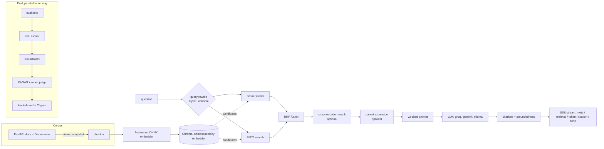

# RAG + Eval Harness

[](https://github.com/RiverRover-stack/RAG-Eval-Harness/actions/workflows/ci.yml)
[](LICENSE)

A RAG pipeline that answers FastAPI questions from its docs + GitHub
Discussions. The core idea: **measure retrieval honestly before trusting
any answer.** Retrieval quality is scored with a judge-free eval (recall,
MRR, nDCG, with confidence intervals) — an LLM judge only grades the
generated *answers*, as a secondary signal.

`docs/plan.md` tracks the phased build in detail. This README is the
short version.

## Why this exists

Early numbers looked like a retrieval problem (faithfulness 0.295, recall
0.378) but weren't — the index was silently missing most of the docs, and
most of the eval questions had no matching document in the corpus at all.
Fixing *measurement* first, before touching the algorithm, moved recall
from 0.378 → 0.43 and nearly doubled faithfulness — see
`runs/_pinned/0001-phase1-corpus-fix/README.md`. This project reports the
honest number next to the flattering one, always.

## Results

Retrieval ablation on `docs_synth_v1` (n=56). Each row adds one stage:

| config | recall@5 [95% CI] | MRR |
|---|---|---|
| dense only | 0.72 [0.62, 0.83] | 0.73 |
| + BM25 fusion | 0.73 [0.63, 0.82] | 0.79 |
| + rerank | 0.71 [0.61, 0.81] | 0.81 |
| + HyDE rewrite | 0.69 [0.58, 0.79] | 0.78 |

Every row's confidence interval overlaps — no stage combination is a clear
recall win yet, though ranking (MRR) improves with hybrid retrieval. That's
why the API defaults to dense-only rather than the fanciest config. Full
numbers: `runs/_pinned/000{3..7}-*`.

## Architecture



## How to use this project

**1. Install and configure**
```bash
uv sync --extra dev
cp .env.example .env   # add GITHUB_TOKEN + a provider key (Groq/Gemini) or run Ollama locally
```

**2. Get the corpus and build the index** (one-time)
```bash
uv run python scripts/fetch_corpus.py
uv run python -m rag_eval.ingestion.discussions_snapshot --max-pages 6
make index
```

**3. Ask it a question**
```bash
make serve   # starts the API on :8000
curl -N -X POST localhost:8000/api/ask \
  -H 'content-type: application/json' \
  -d '{"question": "How do I make a query parameter required?"}'
```
The response includes the answer, `[n]`-style citations linked to real doc
URLs, and a groundedness score. If nothing retrieved actually supports an
answer, it says so (`INSUFFICIENT_CONTEXT`) instead of guessing. Use
`/api/ask/stream` for token-by-token SSE.

**4. Reproduce or extend the eval**
```bash
make eval                                        # retrieval metrics, no LLM calls
uv run rag-eval eval run --config configs/experiments/hybrid_rerank.yaml  # try an ablation
uv run rag-eval eval judge <run_id>              # grade a run's generated answers (RAGAS)
uv run rag-eval eval rubric <run_id>             # + structured 1-5 rubric judge
uv run rag-eval leaderboard                      # compare runs
```
`rag-eval --help` lists every command. See `docs/phase8-judge-depth.md` for
the judge/rubric workflow in full.

## Methodology, briefly

- Gold labels are keyed by **URL**, not chunk id, so a chunker change never
  invalidates them.
- Retrieval metrics **never call an LLM** — zero generation-side confound.
- Self-retrieval leakage is excluded by default (`self_retrieval: holdout`).
- Every metric is reported with a **bootstrap confidence interval**, not a
  bare point estimate.
- The judge is always a different model than the generator — enforced in
  code, not just convention.
- Three eval sets: `docs_synth_v1` (synthetic, gates CI), `discussions_v2`
  (hand-labeled real questions, a directional counterweight — too small to
  gate on), `discussions_gen_v1` (answer quality only).

## Tests & CI

```bash
make lint && make type && make test
```
335 tests, fully offline (deterministic fake embedder, no live LLM/ONNX
calls). CI also rebuilds the index from the committed snapshot and checks
retrieval metrics against the pinned baseline.

## Deployment

Single Docker image with the index baked in at build time (see
`docs/adr/0005-bake-index-at-build-time.md`), auto-deployed to a Hugging
Face Space on every green `main`.

## Limitations

- No retrieval config is a clear recall winner yet (see Results) — needs a
  larger eval set to say more.
- `discussions_v2` is small (n=7–16); a real-question signal, not a gate.
- The Phase 8 generator A/B (does a better LLM measurably help?) is built
  but hasn't been run live yet.
- No frontend yet — everything is CLI + API.

## License

MIT — see `LICENSE`.
